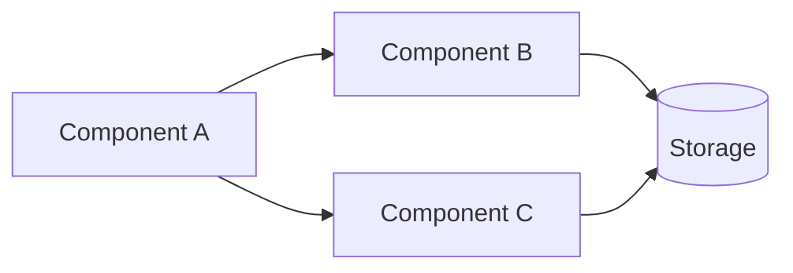
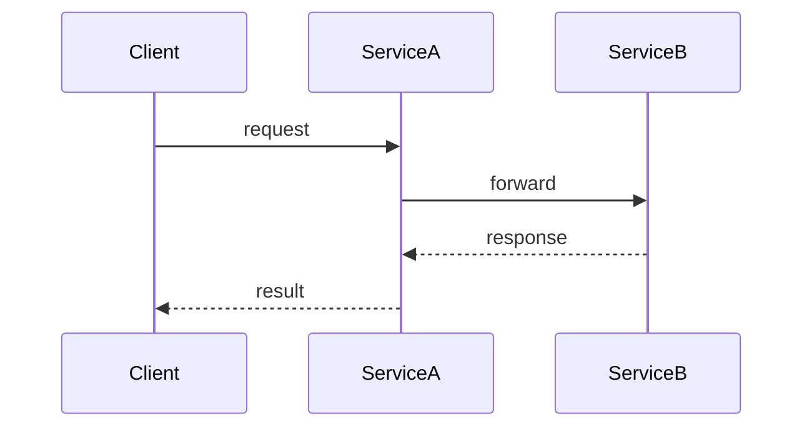

# Writing Documentation

## Overview

All documentation lives under `docs/`, which is the MkDocs source tree (`docs_dir: docs`) published to GitHub Pages. The folder holds **three kinds of documentation with different conventions** — pick the right area first, then follow its rules.

**Core principle:** Match the conventions of the area you are writing in. The strict "concepts not code" rules apply to architecture docs; user-facing guides and the auto-generated API reference follow their own conventions.

**Violating the letter of these rules is violating the spirit of these rules.**

## Documentation Map

| Area | Location | Audience | Conventions | Code snippets? |
|------|----------|----------|-------------|----------------|
| **Architecture** | `docs/architecture/` | Contributors / maintainers | `snake_case` folders, `index.md` + `architecture.md` per topic, this skill's strict rules | **No** — refer to objects by name |
| **User-facing** | `docs/guides/`, `docs/spec/`, `docs/introduction.md`, `docs/quickstart.md`, `docs/cli.md` | Users of the SDK/CLI | `kebab-case.md`, task-oriented prose | **Yes** — bash/CLI/Python examples expected |
| **API Reference** | `docs/api/` | Users browsing the public API | Auto-generated by mkdocstrings from docstrings | N/A — **do not hand-write** |

```
docs/
├── index.md                 # Site home (user-facing landing page)
├── introduction.md          # User-facing
├── quickstart.md            # User-facing
├── cli.md                   # User-facing
├── guides/                  # User-facing how-tos (kebab-case)
├── spec/                    # LCP specification (user-facing)
├── api/                     # Auto-generated API reference (mkdocstrings)
└── architecture/            # ← THIS SKILL'S PRIMARY DOMAIN
    ├── index.md             # Architecture overview + table of contents
    └── topic_name/          # snake_case (e.g. manifest, mcp_server, ai_docgen)
        ├── index.md         # Topic overview + section table of contents
        └── architecture.md  # System design, data flow, internals
```

Adding a doc to the site nav requires an entry in `mkdocs.yml` under the matching section, regardless of area.

---

## Architecture Docs (`docs/architecture/`)

This is what this skill primarily governs: conceptual, design-level documentation for contributors. It focuses on concepts, data flows, and component relationships — **not** implementation code. The audience can read source code themselves.

### When to Write or Update

- New major feature or system is implemented
- Core functionality changes behavior or architecture
- Data flow between components changes significantly
- New integrations or external dependencies are added
- Existing documented behavior is modified or removed

**Do NOT create architecture docs for:**

- Minor bug fixes or cosmetic changes
- Internal refactors that don't change behavior or interfaces
- Trivial configuration changes

### File Conventions

| Rule | Convention |
|------|-----------|
| Location | Under `docs/architecture/` |
| Format | Markdown (`.md`), mkdocs-compatible |
| Naming | `snake_case` folders; files are `index.md` and `architecture.md` |
| Organization | Topic-based subfolders (e.g., `docs/architecture/manifest/`, `docs/architecture/mcp_server/`) |

### Index Files

Every architecture folder MUST have an `index.md` containing:

1. **Overview** — Brief description of what this section covers
2. **Key features** — Bullet list of main capabilities (if applicable)
3. **Table of contents** — Links to all documents in the folder with one-line descriptions
4. **Key components table** — Component name, location (file path), and purpose
5. **Related documentation** — Cross-references to related sections

**Maintenance rule:** When adding or removing an architecture document, ALWAYS update:

- The folder's `index.md`
- The architecture root `docs/architecture/index.md`
- The `mkdocs.yml` nav (under the `Architecture` section)

**No exceptions.** An orphaned document with no index entry is a documentation bug.

### Document Structure

```markdown
# Document Title

## Overview
Brief description of the topic (2-3 sentences max).

## [Core Sections]
Organized by the topic's natural structure.

## Related Documentation
Cross-references to related documents.

---
**Last Updated:** Month Year
**Status:** Implemented | In Progress | Planned
```

### Content Guidelines

**DO**

- Write clear, concise prose accessible to developers of all levels
- Describe functional behavior and data flows
- Use tables for structured reference data (components, configurations)
- Use Mermaid diagrams for architecture, data flows, and component relationships
- Reference classes, functions, and files by name and path
- Cross-reference related documentation sections
- Explain the WHY behind design decisions

**DO NOT**

- Include code snippets or source code blocks
- Copy-paste implementation details
- Write tutorials or step-by-step coding guides
- Document obvious behavior that the code itself makes clear
- Duplicate information that belongs in README or project config files

### Referring to Code Objects

Instead of embedding code, refer to objects by their qualified name and location.

**Bad:** A 10-line code block showing how to call a service method.

**Good:** "Scanning is handled by `scan_package()` in `src/lcp/scanner.py`, which imports the package and walks its modules with `inspect`, producing a `ScannedModule`."

The developer reading this can open the file and understand the implementation. The documentation's job is to explain the concept, purpose, and context — not to replicate the code.

### Diagrams

Use [Mermaid](https://mermaid.js.org/) to illustrate architecture and data flows. Declare diagrams in a fenced code block with the `mermaid` language identifier (rendered natively on the MkDocs site and in GitHub Markdown).

**Flowcharts** — for component interactions, data pipelines, and decision flows:



**Sequence diagrams** — for request/response cycles and multi-service interactions:



| Type | Mermaid keyword | Best for |
|------|-----------------|---------|
| Flowchart | `flowchart` | Component topology, data pipelines, decision trees |
| Sequence | `sequenceDiagram` | API calls, multi-service request flows |
| Class | `classDiagram` | Data models, inheritance hierarchies |
| State | `stateDiagram-v2` | Lifecycle states, status transitions |
| Entity-Relationship | `erDiagram` | Database schemas, domain models |

Use a diagram when multiple components interact in a non-obvious way, data transforms across several layers, or a chain spans services.

### Tables for Reference Data

Use tables for component inventories and configuration:

| Component | Location | Purpose |
|-----------|----------|---------|
| `scan_package` | `src/lcp/scanner.py` | Introspects an installed package into `ScannedModule` |

### Architecture Quality Checklist

- [ ] File is `index.md` or `architecture.md` in a `snake_case` topic folder under `docs/architecture/`
- [ ] Folder's `index.md` updated with link and description
- [ ] `docs/architecture/index.md` updated if a new topic or document was added
- [ ] `mkdocs.yml` nav updated under the `Architecture` section
- [ ] **No code snippets** — only references to objects, classes, and file paths
- [ ] Data flows use Mermaid diagrams where helpful (fenced ` ```mermaid ` block)
- [ ] Tables used for structured reference data
- [ ] Cross-references to related docs included
- [ ] Footer has "Last Updated" and "Status"

---

## User-facing Docs (`docs/guides/`, `docs/spec/`, getting started)

These are written FOR users of the SDK and CLI, not contributors. Conventions differ from architecture docs:

- **Naming:** `kebab-case.md` (e.g., `mcp-server.md`, `ai-docgen.md`).
- **Code is expected:** include `bash`, CLI, and Python examples — users need copy-pasteable commands.
- **Task-oriented:** show how to accomplish a goal step by step.
- **No "Last Updated/Status" footer** — these pages are living user docs.
- **Nav:** add new pages to `mkdocs.yml` under `Get Started`, `Guides`, or `Specification`.

When in doubt about depth, link to the relevant `docs/architecture/` page rather than duplicating internals.

---

## API Reference (`docs/api/`)

The API reference is **auto-generated by mkdocstrings** from the source docstrings — do not hand-write API descriptions here.

- Each page is a thin stub with a `::: lcp.<module>` directive; the content comes from docstrings in `src/lcp/`.
- To improve the rendered reference, **edit the docstrings in the source code**, not the markdown.
- To document a new public module, add a stub page in `docs/api/` and a nav entry under `API Reference` in `mkdocs.yml`.

---

## Red Flags — STOP and Revise

- Writing in `docs/architecture/` and about to paste a code block → refer to the object by name instead
- Architecture document has no entry in its folder's `index.md` → update the index first
- Architecture file/folder uses camelCase or kebab-case → use `snake_case` (files are `index.md`/`architecture.md`)
- Guide uses `snake_case.md` → rename to `kebab-case.md`
- Hand-writing API descriptions in `docs/api/` → edit the source docstring instead
- Added any page but forgot the `mkdocs.yml` nav entry → add it
- Content duplicates another document → cross-reference instead

## Common Mistakes

| Mistake | Fix |
|---------|-----|
| Adding an architecture doc but forgetting the index | Update folder `index.md` AND `docs/architecture/index.md` |
| Adding any page but forgetting the nav | Update the matching section in `mkdocs.yml` |
| Code snippets in architecture docs | Replace with prose describing the object and its parameters |
| Editing `docs/api/*.md` to fix API wording | Edit the docstring in `src/lcp/` instead |
| Mixing user-facing and architecture conventions | Decide the area first (see Documentation Map), then follow its rules |
| Flat file dump in `docs/architecture/` | Group related files into `snake_case` topic subfolders |
