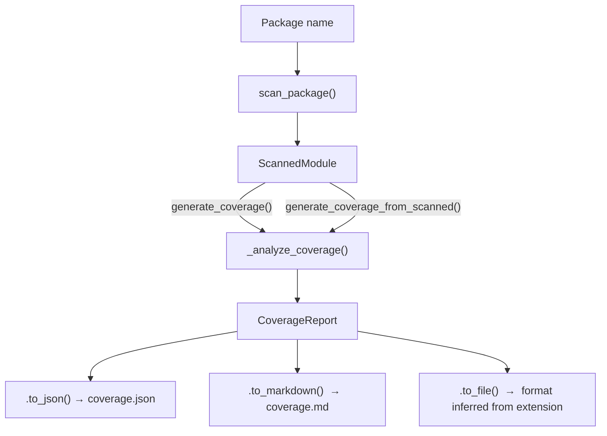

# Coverage

## Overview

The Coverage module analyzes an installed Python package and measures how many of its public symbols have docstrings. It produces a `CoverageReport` containing per-kind statistics and a list of every undocumented symbol — including the source file where each one lives. The report can be serialized to JSON or Markdown and is the required input for the [AI DocGen](../ai_docgen/index.md) pipeline.

## Key Features

- Reuses the same scanner as `lcp scan`, so coverage results are consistent with the generated LCP manifest
- Breaks down results by symbol kind (function, class, method, attribute, module)
- Emits a flat list of undocumented symbols with their module path and source file location
- Outputs JSON (default) or human-readable Markdown
- Combinable with `lcp scan` via `--coverage` to avoid scanning twice

## Key Components

| Component | Location | Purpose |
|-----------|----------|---------|
| `generate_coverage()` | `src/lcp/coverage.py` | Public API: scans a package and returns a `CoverageReport` |
| `generate_coverage_from_scanned()` | `src/lcp/coverage.py` | Builds a `CoverageReport` from an existing `ScannedModule` |
| `CoverageReport` | `src/lcp/coverage.py` | Full report: package metadata, summary statistics, undocumented symbols |
| `CoverageSummary` | `src/lcp/coverage.py` | Aggregate stats: total, documented, undocumented, coverage%, by-kind breakdown |
| `KindStats` | `src/lcp/coverage.py` | Per-kind counts: total, documented, undocumented |
| `UndocumentedSymbol` | `src/lcp/coverage.py` | One undocumented symbol: kind, module path, entity name, source file |

## Data Flow

`_analyze_coverage()` walks all `ScannedSymbol` objects recursively (including class members), checks each for a non-empty `summary` field, and accumulates `KindStats` and `UndocumentedSymbol` entries. A symbol is considered documented when its `summary` is not `None` and does not begin with `"Module "` — the placeholder the scanner inserts for modules that lack a module-level docstring.

## CLI Usage

### Standalone coverage command

The `lcp coverage` command accepts a package name and writes the report to a file or stdout. The output format defaults to JSON and can be switched to Markdown via `--format markdown`; when writing to a `.md` file the format is inferred automatically from the extension.

| Flag | Default | Purpose |
|------|---------|---------|
| `<package>` | *(required)* | Name of an installed Python package |
| `-o` / `--output` | stdout | Output file path |
| `--format` | `json` | `json` or `markdown`; inferred from `.md` extension if omitted |
| `--include-private` | off | Include symbols whose names start with `_` |
| `--no-recursive` | off | Only scan the top-level module, not submodules |

### Combined scan + coverage

`lcp scan` accepts a `--coverage` flag that writes a coverage report alongside the manifest. Both outputs are produced from a single scan, so the package is imported and introspected only once. This is equivalent to running `lcp coverage` separately but avoids the redundant work.

## Python API

`generate_coverage()` in `src/lcp/coverage.py` is the primary entry point. It accepts a package name, `include_private`, and `recursive` flags, calls `scan_package()` internally, and returns a `CoverageReport`. When a `ScannedModule` is already available — for example, after calling `scan_package()` to produce a manifest — `generate_coverage_from_scanned()` accepts it directly and skips the scan step.

## Output Format

### JSON

The JSON report is the format consumed by `lcp docgen`. The top-level object contains the package name, version, and UTC generation timestamp. The `summary` object holds aggregate counts and a `by_kind` breakdown where each key is a symbol kind (`function`, `class`, `method`, etc.) mapped to its total, documented, and undocumented counts. The `undocumented` array lists each missing symbol with its kind, module path, entity name (using the `Class#method` convention from LCP symbol IDs), and source file path.

### Markdown

The Markdown report is intended for human review. It renders a summary table broken down by kind and a grouped list of all undocumented symbols with their source file paths.

## Integration with AI DocGen

The JSON coverage report is the required input for `lcp docgen`. The `lcp coverage` command produces the file; `lcp docgen` reads it and calls an LLM to generate the missing docstrings. See [AI DocGen](../ai_docgen/index.md) for details on the generation pipeline.

## Related Documentation

- [AI DocGen](../ai_docgen/index.md) - Consumes the JSON coverage report to generate missing docstrings

---
**Last Updated:** February 2026
**Status:** Implemented
