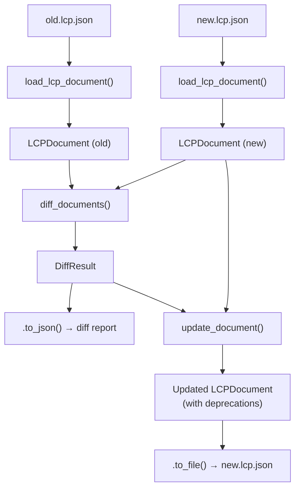

# Version Diff

## Overview

The Version Diff module compares two LCP manifests — typically generated from different versions of the same library — and detects symbols that were removed between releases. Removed symbols are automatically flagged as deprecated, producing `Deprecation` entries that can be merged back into the newer manifest. This enables library maintainers and tooling to track API deprecations across versions without manual bookkeeping.

## Key Features

- Compares two LCP documents by symbol ID, detecting additions and removals
- Generates `Deprecation` entries for every removed symbol, with `deprecated_in` set to the new version
- Merges detected deprecations into the new manifest while preserving existing entries
- CLI `--update` flag to write deprecations back into the new file in a single command
- JSON diff report with summary counts, per-symbol details, and deprecation entries

## Documents

- [Architecture](architecture.md) - Internal data structures, comparison logic, and update strategy

## Key Components

| Component | Location | Purpose |
|-----------|----------|---------|
| `diff_documents()` | `src/lcp/diff.py` | Compares two `LCPDocument` objects and returns a `DiffResult` |
| `update_document()` | `src/lcp/diff.py` | Merges deprecation entries from a `DiffResult` into an `LCPDocument` |
| `load_lcp_document()` | `src/lcp/diff.py` | Reads and validates a `.lcp.json` file into an `LCPDocument` |
| `DiffResult` | `src/lcp/diff.py` | Dataclass holding removed/added symbols and generated deprecations |
| `SymbolDiff` | `src/lcp/diff.py` | Dataclass describing a single symbol difference |
| CLI `diff` command | `src/lcp/cli.py` | Thin wrapper exposing `diff_documents` and `update_document` to the CLI |

## Data Flow



## CLI Usage

The `lcp diff` command accepts two LCP file paths and produces a JSON diff report. By default the report is printed to stdout; status messages go to stderr.

| Flag | Default | Purpose |
|------|---------|---------|
| `<OLD>` | *(required)* | Path to the earlier `.lcp.json` file |
| `<NEW>` | *(required)* | Path to the later `.lcp.json` file |
| `-o` / `--output` | stdout | Write the diff report to a file instead of stdout |
| `--indent` | `2` | JSON indentation level |
| `--update` | off | Write detected deprecations back into the NEW file |

### Examples

```bash
# Compare two versions and print the diff report
lcp diff v1.lcp.json v2.lcp.json

# Save the diff report to a file
lcp diff v1.lcp.json v2.lcp.json -o diff.json

# Compare and automatically update the new manifest with deprecation entries
lcp diff v1.lcp.json v2.lcp.json --update
```

When `--update` is used, the command loads both files, computes the diff, writes the diff report as usual, and then writes the new file back to disk with the generated deprecation entries merged in. Existing deprecation entries in the new file are preserved — only new entries for newly removed symbols are added.

## Python API

`diff_documents()` in `src/lcp/diff.py` is the primary entry point. It accepts two `LCPDocument` objects (old and new), compares their symbol sets, and returns a `DiffResult`. Symbols present in the old document but absent in the new one are treated as removed, and a `Deprecation` entry is created for each with `deprecated_in` set to the new document's version string.

`update_document()` takes an `LCPDocument` and a `DiffResult` and returns a new `LCPDocument` with the deprecation entries merged in. Existing deprecation entries in the document are preserved; entries from the diff result are only added for symbol IDs that do not already have an entry.

`load_lcp_document()` is a convenience function that reads a `.lcp.json` file from disk and returns a validated `LCPDocument`.

### Example

```python
from lcp import diff_documents, load_lcp_document, update_document

# Load two versions
old = load_lcp_document("v1.lcp.json")
new = load_lcp_document("v2.lcp.json")

# Compare
result = diff_documents(old, new)
print(f"Removed: {len(result.removed)}, Added: {len(result.added)}")

for sid, dep in result.deprecated.items():
    print(f"  {sid}: deprecated in {dep.deprecated_in}")

# Merge deprecations into the new document and save
updated = update_document(new, result)
updated.to_file("v2.lcp.json")
```

## Diff Report Format

The JSON diff report produced by `DiffResult.to_dict()` / `DiffResult.to_json()` contains:

| Field | Type | Description |
|-------|------|-------------|
| `library` | string | Library name from the new manifest |
| `old_version` | string | Version string of the old document |
| `new_version` | string | Version string of the new document |
| `summary` | object | `{ "removed": int, "added": int }` counts |
| `removed` | array | List of removed symbols (id, kind, module, summary) |
| `added` | array | List of added symbols (id, kind, module, summary) |
| `deprecations` | object | Map of symbol ID → `Deprecation` entry for each removed symbol |

Each entry in the `removed` and `added` arrays is an object with `symbol_id`, `kind`, `module`, and `summary` fields.

## Integration with Other Features

| Feature | How it connects |
|---------|----------------|
| [Manifest Generation](../manifest/index.md) | `lcp scan` produces the `.lcp.json` files that feed into `lcp diff` |
| [MCP Server](../mcp_server/index.md) | Updated manifests (with deprecation entries) can be served to AI agents |

## Related Documentation

- [Architecture](architecture.md) - Comparison algorithm, update strategy, and data structures

---
**Last Updated:** March 2026
**Status:** Implemented
