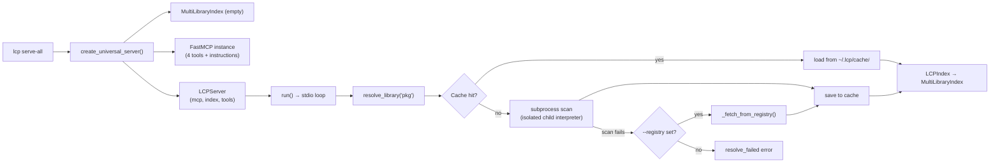
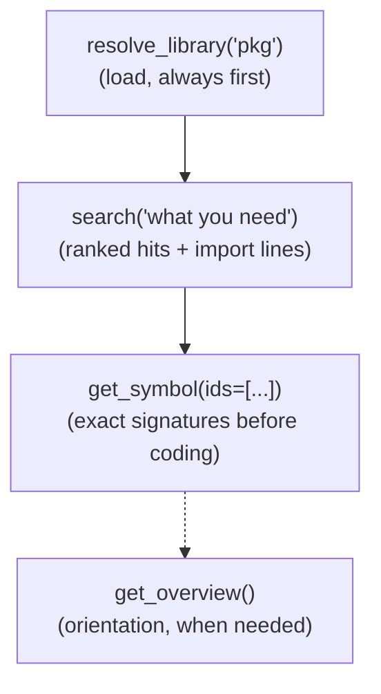

# MCP Server - Architecture

## Overview

The MCP Server exposes Python library documentation as a small set of MCP tools that AI agents call to explore any library's public API. It is built on [FastMCP](https://github.com/jlowin/fastmcp) and has a single implementation: the universal server (`create_universal_server` / `lcp serve-all`), which resolves any pip-installed package on demand with optional local caching and a remote registry fallback. The deprecated single-manifest entry points (`create_server` / `lcp serve`) are thin wrappers that build the same universal server pre-loaded with one manifest and restricted to its library.

The tool surface was consolidated to four tools designed around a three-call happy path (`resolve_library` → `search` → `get_symbol`), with the usage guidance moved into the server's MCP *instructions* field so it reaches agents even before the first tool call.

## Server Lifecycle

Tool registration lives in a single function, `_register_tools()` in `src/lcp/mcp_server.py`, parameterized by the `MultiLibraryIndex` registry, the cache/registry settings, an optional package allow-list, the response byte budget, and the scan configuration (mode, interpreter, timeout). Both CLI entry points share it, which removed the ~450 lines previously duplicated between the two servers. `create_universal_server()` returns an `LCPServer` dataclass bundling the FastMCP instance, the index registry, and the raw tool callables — the latter is what the test suite and the startup preload loop invoke directly, replacing the former `tool_funcs` attribute-stuffing.

## Subprocess Scanning

The live-scan step of `resolve_library_document()` runs in a **disposable, isolated child interpreter** by default, implemented by `scan_package_subprocess()` in `src/lcp/subprocess_scan.py`. The child runs *only* raw introspection: it loads the self-contained `scanner.py` and the stdlib-only `_childscan.py` **by absolute file path** and emits the `ScannedModule` tree as JSON via `scanned_to_dict()`. The host then rebuilds it with `scanned_from_dict()` and runs `generate_lcp()` with its own `pydantic`. Three problems motivated moving the scan out of the server process:

1. **Crash isolation** — importing a package executes its import-time code; a package that raises `SystemExit` (or crashes the interpreter) must degrade to a structured `resolve_failed` error, not take the agent-facing server down.
2. **Responsiveness** — FastMCP runs sync tools on worker threads, but the CPython import lock and the GIL still stall *concurrent* tool calls while a heavy import runs in-process. Waiting on a child process holds neither.
3. **Cross-environment reach** — the server's environment is often not the project's environment (the #1 real-world friction). The child interpreter is configurable (`scan_python`), so the server can document packages installed in a different virtualenv.

The child signals success and failure class by exit code (0 success, 3 import failure, 4 scan failure), with one structured JSON error object on stderr; the same contract as the public same-venv entry point `lcp.scanjson`, documented in the [CLI reference](../../cli.md). On success the child's stdout carries the raw `ScannedModule` tree rather than a finished LCP document — a format that never needs versioning, because the host hands the child the very same `scanner.py` it deserializes with.

Two design rules keep the cross-environment path correct:

- **Isolate the child; load by path, never leak site-packages.** The child adds only the caller's `extra_paths` to its `sys.path` and loads `scanner.py`/`_childscan.py` by absolute path, so `lcp/__init__.py` — and thus `pydantic` and `fastmcp` — never runs in the target interpreter. The host's `site-packages` is never exposed: target submodules cannot import host packages (so the same package/version yields the same manifest from any host), and the target's `pydantic_core` cannot collide with the host's `pydantic` (so `pydantic-core` itself is scannable). The target environment needs neither `lcp` nor `pydantic` installed. This is the fix for the contamination and `pydantic-core` failures reported in issue #52.
- **Fallback only on spawn failure, and only for the server's own environment.** `_scan_live()` retries in-process solely when the subprocess could not be *spawned* (no package code ran) and no `scan_python` is configured. A spawn failure with a configured interpreter errors instead of silently scanning the wrong venv, and a scan *crash* is never retried in-process — that would re-import the crashing package inside the server.

`resolve_library_document()` remains the single choke point: the cache write side effect and the cache → scan → registry resolution order are identical in both scan modes, and the "installed in a different environment" error now names the actual scan interpreter and its `.lcp-config.json` remedy (`scan_python` / `python`).

**Residual trust model:** process isolation contains crashes and hangs; it is not a sandbox. The scanned package's import-time code still executes with the user's permissions, in the child. This is documented honestly in the [server guide](../../guides/mcp-server.md) rather than papered over.

## Index Design

`LCPIndex` is built once per library from its `LCPDocument` and kept in memory for the lifetime of the server. It maintains seven lookup structures derived from two passes over the symbol map:

| Index | Key | Value |
|-------|-----|-------|
| `symbols_by_id` | `symbol_id` (str) | `Symbol` object |
| `symbols_by_module` | module path (str) | list of `symbol_id` strings |
| `symbols_by_kind` | kind value (str) | list of `symbol_id` strings |
| `class_members` | class `symbol_id` | list of member `symbol_id` strings |
| `classes_by_name` | bare class name (str) | sorted list of class `symbol_id` strings |
| `alias_to_canonical` | alias `symbol_id` | canonical `symbol_id` |
| `preferred_alias` | canonical `symbol_id` | preferred display `symbol_id` |

Class membership is determined by the presence of `#` in the symbol ID (e.g. `pathlib:Path#resolve` belongs to `pathlib:Path`). `classes_by_name` supports exact return-type-to-class resolution in `get_symbol`'s usage hints — an exact-name lookup that replaced the old suffix-matching heuristic and its false positives (e.g. `PurePath` matching a `Path` query).

### Alias Resolution

The alias structures are built in a second pass from each symbol's `aliases` manifest field (see the [manifest architecture](../manifest/architecture.md) for how the scanner records them). For an aliased **class**, member alias IDs (`requests:Session#get` → `requests.sessions:Session#get`) are derived at build time rather than materialized in the manifest, so alias support adds no manifest weight. An alias that collides with a real canonical ID is ignored — canonical entries always win.

`preferred_alias` picks the most documentation-like path per symbol (fewest module dots, then shortest, then lexicographic — the package-root re-export wins) via `_alias_rank()`. Responses are **alias-first**: `search` hits present the preferred importable ID with `resolved_via_alias` naming the definition site; `get_symbol` accepts canonical and alias IDs alike through `LCPIndex.resolve_id()`, echoes the requested ID, and always renders the `import` line from the preferred path. This closes the measured "verify canonical, write package-root import" gap: agents copy the ID and import line they see.

`MultiLibraryIndex` wraps the loaded libraries together with the source each was resolved from (`cache`, `scan`, `registry`, or `manifest`). There is deliberately **no** implicit default library: its `resolve()` method returns the single loaded library when the `library` argument is omitted, and a structured `ambiguous_library` error listing the loaded names when two or more are loaded. This replaced the last-resolved-wins default, whose silent reassignment made multi-library answers non-deterministic.

## Error Model

Every tool returns a structured error dict with a stable shape on failure — `error.code`, `error.message`, an actionable `error.hint`, and context keys such as `loaded_libraries`. Recoverable conditions never raise protocol-level exceptions, because agents recover from data better than from aborted calls. Error codes: `library_not_loaded`, `ambiguous_library`, `library_not_exposed`, `resolve_failed`, `invalid_kind`; unresolved symbol ids are reported per-id in `get_symbol`'s `not_found` list.

## Response Caps

Every list-returning payload is capped by a configurable byte budget (`DEFAULT_MAX_RESPONSE_BYTES`, 25 000 bytes, CLI flag `--max-response-bytes`), enforced by keeping the longest prefix that fits and setting a `truncated` flag with a follow-up hint. `search` additionally caps by `limit` (default 20, max 100). Inline class members get 80 % of the budget so the class body always fits. Within a single `get_symbol` entry the sacrifice order is: trailing `semantics.examples` entries first (`examples_truncated` marker), then the description text (`description_truncated`), then the member list (`members_truncated`) — structured signature data is never dropped. The cap was calibrated against polars' `DataFrame` (159 members, ~30 KB of member summaries) — heavy classes are expected to truncate.

## Cache Design

Manifests are cached as gzip-compressed `.lcp.json.gz` files under `~/.lcp/cache/{name}/{version}.lcp.json.gz`. `load_lcp_document()` detects the `.gz` extension and decompresses transparently, so callers need not distinguish between formats.

| Situation | Cache behaviour |
|-----------|----------------|
| Package has `importlib.metadata` version | Exact version match required |
| Explicit `version` passed to `resolve_library` | That version wins over the installed one for cache lookup and registry fetch |
| Package has no metadata version | Any cached entry for that name is returned |
| `--no-cache` flag | Cache reads and writes are both skipped; registry fallback still applies |
| Cache write failure | Silently ignored (non-fatal) |
| Legacy `.lcp.json` entry found | Loaded transparently as a fallback when no `.lcp.json.gz` exists |
| `--registry` URL provided | When both cache and live scan fail, the manifest is fetched from the remote registry using the sharded path `{registry}/manifests/{language}/{first_letter}/{slug}/{version}.lcp.json.gz`, where `{slug}` is the hyphenated package name (`google.adk` → `google-adk`). When no version is known, the package's `latest.json` pointer is read to resolve the canonical manifest file |

## Tool Inventory

| Tool | Purpose |
|------|---------|
| `resolve_library(name, version?)` | Load a library from cache, live scan, or remote registry; records the resolution source. Flags a `version_mismatch` warning when the resolved version differs from the requested one, and carries a top-level `version_mismatch` honesty flag (with `installed_version` and `resolved_version`) whenever a cache or registry hit serves a version that differs from — or cannot be confirmed against — the locally installed package. |
| `search(query, library?, module?, kind?, limit?)` | Ranked discovery: exact name > name prefix > name substring > summary > description, stable id tie-break. An empty query browses in deterministic `(kind, name)` order. Every hit carries the exact import line. |
| `get_symbol(ids, library?)` | Batch detail: full signatures, usage hints (required/optional parameters, async flag, return type, `returns_classes` resolution), the import line, and — for classes — every member inlined as a one-line summary. |
| `get_overview(library?)` | Library identity (name, version, language, resolution source) plus the module tree with per-module symbol counts. |

Nine tools from the previous surface were removed: `get_usage_guide` (content moved to the `instructions` field), `get_manifest` and `list_modules` (folded into `get_overview`), `list_symbols` and `search_symbols` (folded into `search`), `get_class_members` (members inline in `get_symbol`), `explore_return_type` (its exact-match core became `usage_hints.returns_classes`), `get_suggestions` (an LLM with ranked search beats a bag-of-words matcher), and `list_libraries` (loaded libraries appear in `resolve_library` responses and in disambiguation errors). The rationale for each removal is recorded in the V2 surface design spec (Phase 1 deliverable).

## Recommended Exploration Workflow

## Symbol ID Format

Symbol IDs follow the format `module_path:entity_path`, where class members use a `#` separator:

| Example ID | Refers to |
|------------|-----------|
| `json:loads` | Top-level function `loads` in the `json` module |
| `pathlib:Path` | Class `Path` in the `pathlib` module |
| `pathlib:Path#resolve` | Method `resolve` on `pathlib.Path` |

This format is used as keys in all index structures, in `search` results, and as the identifiers passed to `get_symbol`.

## CLI Integration

| Command | Delegates to |
|---------|-------------|
| `lcp serve-all` | `run_universal_server(name=..., cache_dir=..., expose=..., preload=..., max_response_bytes=..., scan_mode=..., scan_python=..., scan_timeout=...)` |
| `lcp serve <manifest>` (deprecated) | `run_server(manifest_path, name=...)`, which builds the universal server pre-loaded with the manifest |

## Related Documentation

- [MCP Server Overview](index.md)
- [AI DocGen](../ai_docgen/index.md) - Generates the docstrings that populate the `semantics.summary` and `semantics.description` fields used by search ranking

---
**Last Updated:** July 2026
**Status:** Implemented
