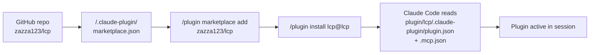
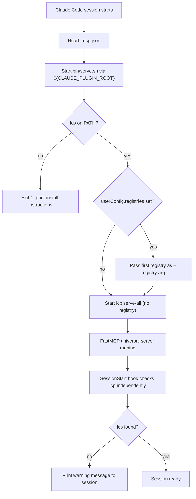
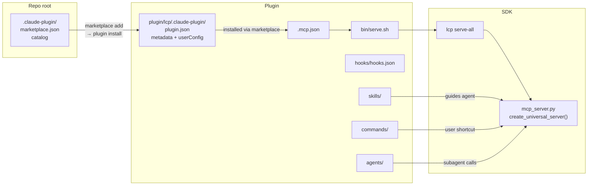

# Claude Code Plugin - Architecture

## Overview

The LCP plugin packages `lcp serve-all` as a Claude Code plugin, enabling the agent to access real-time Python library documentation via MCP without any per-project configuration. The plugin is distributed through the Claude Code marketplace, which governs how it is discovered, installed, and configured.

## Repository Structure

The plugin spans two locations within the `zazza123/lcp` repository:

```
lcp/                               # repository root
├── .claude-plugin/
│   └── marketplace.json           # Marketplace catalog: declares the repo as a marketplace
│                                  # and lists available plugins with their source paths
└── plugin/lcp/                    # Plugin root (source for the lcp@lcp plugin)
    ├── .claude-plugin/
    │   └── plugin.json            # Plugin manifest: id, name, version, keywords, userConfig schema
    ├── .mcp.json                  # MCP server declaration pointing to bin/serve.sh
    ├── agents/
    │   └── library-explorer.md   # Read-only haiku subagent for deep library research
    ├── bin/
    │   └── serve.sh              # Startup wrapper: validates lcp, injects registries
    ├── commands/
    │   ├── resolve.md            # /lcp:resolve <package> shortcut
    │   └── scan.md               # /lcp:scan <package> shortcut
    ├── hooks/
    │   └── hooks.json            # SessionStart lifecycle hook
    ├── skills/
    │   ├── lcp-universal/
    │   │   └── SKILL.md          # Proactive library resolution skill
    │   └── lcp-usage/
    │       └── SKILL.md          # General LCP usage guidance skill
    └── README.md
```

## Marketplace Distribution

The Claude Code plugin marketplace uses a two-layer file structure. The root `/.claude-plugin/marketplace.json` is the **marketplace catalog** — it registers the GitHub repository as a marketplace and declares which plugins are available within it, each with a `source` path pointing to a subdirectory. The `plugin/lcp/.claude-plugin/plugin.json` is the **plugin manifest** — it contains the plugin's metadata, keywords, and the `userConfig` schema that Claude Code presents during installation.

When a user runs `/plugin marketplace add zazza123/lcp`, Claude Code fetches the repository's marketplace catalog. When they subsequently run `/plugin install lcp@lcp`, Claude Code reads the plugin manifest from the path declared in the catalog (`./plugin/lcp`), registers the MCP server, skills, commands, hooks, and subagent, and exposes the `userConfig` inputs.

The `userConfig.registries` field lets users provide a comma-separated list of LCP registry URLs. Claude Code injects the configured value as the `CLAUDE_PLUGIN_OPTION_registries` environment variable at runtime, which `bin/serve.sh` picks up to pass the first registry URL to `lcp serve-all --registry`.



## MCP Server Startup Flow

When Claude Code opens a session with the plugin installed, it reads `.mcp.json` and starts the declared MCP server. The startup sequence runs through `bin/serve.sh`:



The `SessionStart` hook in `hooks/hooks.json` is independent of the wrapper — it runs as a shell command at the start of every session to provide a human-readable warning if `lcp` is missing, even when the MCP server has already failed silently.

## Skills Design

Skills are auto-invoked by Claude Code based on their `description` frontmatter. Both skills accept `$ARGUMENTS` for direct invocation:

| Skill | Invocation mode | Description match |
|-------|-----------------|-------------------|
| `lcp-universal` | Automatic + `/lcp:lcp-universal <library>` | Triggers when implementing code against any third-party Python library |
| `lcp-usage` | Automatic + `/lcp:lcp-usage <library>` | Triggers on LCP tool usage guidance requests |

`lcp-universal` is the primary skill. It instructs the agent to call `resolve_library("package")` before writing any code that uses an external library, then follow the structured exploration workflow defined in the MCP server's `get_usage_guide` tool.

## Commands Design

Commands are user-invoked `/lcp:<name> <args>` shortcuts that route `$ARGUMENTS` to a specific workflow:

| Command | User invokes | Behaviour |
|---------|-------------|-----------|
| `resolve` | `/lcp:resolve requests` | Resolves the library and summarises its public API |
| `scan` | `/lcp:scan requests` | Scans the package and produces a human-readable module and symbol summary |

Commands are lighter than skills — they don't trigger automatically and don't modify agent behaviour globally. They are user-controlled entry points for explicit, one-shot library operations.

## Library Explorer Agent

`agents/library-explorer.md` defines a subagent with the following constraints:

| Parameter | Value | Rationale |
|-----------|-------|-----------|
| `model` | `haiku` | Fast and cheap for read-only tool calls |
| `effort` | `low` | No reasoning needed for structured tool traversal |
| `maxTurns` | 15 | Bounded exploration; prevents runaway tool chains |
| `disallowedTools` | `Write, Edit, MultiEdit` | Read-only — never modifies project files |

The agent is invoked by the parent agent to delegate deep library research without consuming the parent's context budget.

## userConfig: Registry List

`plugin.json` declares a `userConfig.registries` field (string, comma-separated) to let teams configure one or more LCP registry URLs. `bin/serve.sh` reads `CLAUDE_PLUGIN_CONFIG_REGISTRIES` and passes the first URL to `lcp serve-all --registry`.

This supports the pattern of teams hosting a private `lcp-registry` containing pre-built manifests for internal packages that cannot be pip-installed in a CI/agent environment.

## Relationship to the MCP Server

The plugin is a packaging and configuration layer. All library resolution, caching, tool dispatch, and registry fallback logic lives in `src/lcp/mcp_server.py`. The plugin itself adds nothing to the MCP server's behaviour — it provides the lifecycle wiring (startup, hooks), the agent guidance layer (skills, commands, subagent), and the marketplace metadata.



## Related Documentation

- [MCP Server Architecture](../mcp_server/architecture.md) — Tool inventory, index design, universal server lifecycle
- [Registry Publish](../publish/index.md) — How manifests are published to the remote registry used as plugin fallback

---
**Last Updated:** May 2026 (updated: marketplace catalog)
**Status:** Implemented
