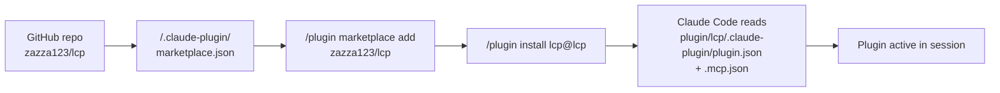
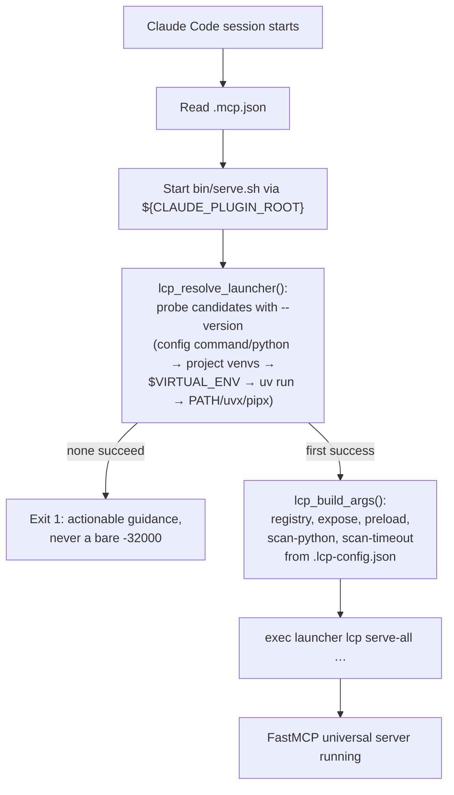
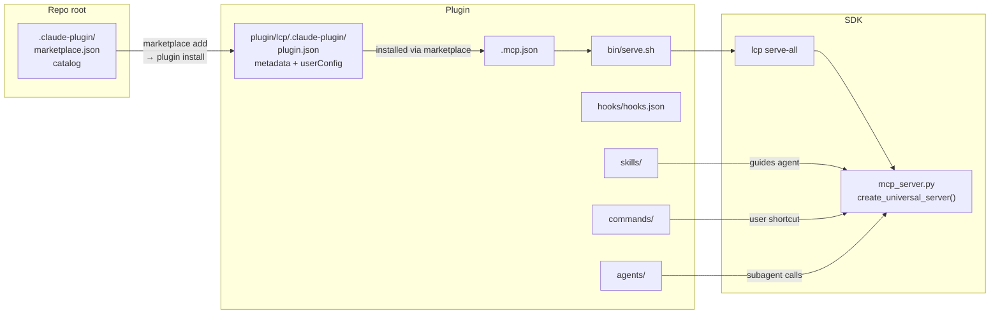

# Claude Code Plugin - Architecture

## Overview

The LCP plugin packages `lcp serve-all` as a Claude Code plugin, enabling the agent to access real-time Python library documentation via MCP without any per-project configuration. The plugin is distributed through the Claude Code marketplace, which governs how it is discovered, installed, and configured.

## Repository Structure

The plugin spans two locations within the `zazza123/lcp` repository:

```
lcp/                               # repository root
├── .claude-plugin/
│   └── marketplace.json           # Marketplace catalog: declares the repo as a marketplace
│                                  # and lists available plugins with their source paths
└── plugin/lcp/                    # Plugin root (source for the lcp@lcp plugin)
    ├── .claude-plugin/
    │   └── plugin.json            # Plugin manifest: id, name, version, keywords, userConfig schema
    ├── .mcp.json                  # MCP server declaration pointing to bin/serve.sh
    ├── agents/
    │   └── library-explorer.md   # Read-only haiku subagent for deep library research
    ├── bin/
    │   └── serve.sh              # Startup wrapper: resolves the launcher, builds serve-all args
    ├── commands/
    │   ├── configure.md          # /lcp:configure — guided .lcp-config.json setup/repair
    │   ├── resolve.md            # /lcp:resolve <package> shortcut
    │   └── scan.md               # /lcp:scan <package> shortcut
    ├── hooks/
    │   ├── hooks.json            # SessionStart + PreToolUse hook declarations
    │   ├── generate-config.sh    # SessionStart: seed .lcp-config.json from userConfig
    │   └── verify_reminder.py    # PreToolUse: hold the first unverified Python write
    ├── skills/
    │   ├── lcp-configure/
    │   │   └── SKILL.md          # Config setup/repair wizard skill
    │   ├── lcp-universal/
    │   │   └── SKILL.md          # Proactive library resolution skill
    │   └── lcp-usage/
    │       └── SKILL.md          # General LCP usage guidance skill
    └── README.md
```

Shell tests for the wrapper and hooks live at the repository root in `tests/plugin/` (run via `run_all.sh`); they source `serve.sh` in lib mode (`LCP_SERVE_LIB=1`) to test its functions without starting a server.

## Marketplace Distribution

The Claude Code plugin marketplace uses a two-layer file structure. The root `/.claude-plugin/marketplace.json` is the **marketplace catalog** — it registers the GitHub repository as a marketplace and declares which plugins are available within it, each with a `source` path pointing to a subdirectory. The `plugin/lcp/.claude-plugin/plugin.json` is the **plugin manifest** — it contains the plugin's metadata, keywords, and the `userConfig` schema that Claude Code presents during installation.

When a user runs `/plugin marketplace add zazza123/lcp`, Claude Code fetches the repository's marketplace catalog. When they subsequently run `/plugin install lcp@lcp`, Claude Code reads the plugin manifest from the path declared in the catalog (`./plugin/lcp`), registers the MCP server, skills, commands, hooks, and subagent, and exposes the `userConfig` inputs.

The `userConfig` fields (`registries`, `lcpCommand`, `pythonPath`) are delivered by Claude Code as environment variables to the **SessionStart hook only** (`CLAUDE_PLUGIN_OPTION_REGISTRIES`, `CLAUDE_PLUGIN_OPTION_LCPCOMMAND`, `CLAUDE_PLUGIN_OPTION_PYTHONPATH`); `generate-config.sh` seeds them into `.lcp-config.json` when no config exists yet. `bin/serve.sh` reads the config *file*, never those variables — after the first session, the file is the single source of truth and can be edited directly.


```mermaid
flowchart LR
    A["GitHub repo\nzazza123/lcp"] --> B["/.claude-plugin/\nmarketplace.json"]
    B --> C["/plugin marketplace add\nzazza123/lcp"]
    C --> D["/plugin install lcp@lcp"]
    D --> E["Claude Code reads\nplugin/lcp/.claude-plugin/plugin.json\n+ .mcp.json"]
    E --> F["Plugin active in session"]
```

## MCP Server Startup Flow

When Claude Code opens a session with the plugin installed, it reads `.mcp.json` and starts the declared MCP server. The startup sequence runs through `bin/serve.sh`:


```mermaid
flowchart TD
    A["Claude Code session starts"] --> B["Read .mcp.json"]
    B --> C["Start bin/serve.sh via ${CLAUDE_PLUGIN_ROOT}"]
    C --> D["lcp_resolve_launcher():\nprobe candidates with --version\n(config command/python → project venvs →\n$VIRTUAL_ENV → uv run → PATH/uvx/pipx)"]
    D -- none succeed --> E["Exit 1: actionable guidance,\nnever a bare -32000"]
    D -- first success --> F["lcp_build_args():\nregistry, expose, preload,\nscan-python, scan-timeout\nfrom .lcp-config.json"]
    F --> G["exec launcher lcp serve-all …"]
    G --> H["FastMCP universal server running"]
```

Every launcher candidate is probed with `--version` before use, so a non-runnable pyenv/conda shim is skipped instead of failing at MCP handshake time. The config file is resolved as `${CLAUDE_PROJECT_DIR}/.lcp-config.json` first, then a legacy `${CLAUDE_PROJECT_DIR}/.lcp.json` (deprecated — the wrapper prints a one-line rename notice on stderr), then `~/.lcp/config.json`.

### Lifecycle Hooks

`hooks/hooks.json` declares two hooks that run independently of the wrapper:

| Hook | Event | Behaviour |
|------|-------|-----------|
| `generate-config.sh` | `SessionStart` | Seeds `.lcp-config.json` from the `userConfig` environment variables when no config exists (a legacy `.lcp.json` counts as existing); never overwrites an edited file, never blocks the session |
| `verify_reminder.py` | `PreToolUse` (`Write\|Edit`) | Holds the session's first Python-file write once when no `lcp` tool was consulted, reminding the agent to verify library APIs first; repeating the write proceeds normally |

### Launcher Interpreter vs Scan Interpreter

`serve.sh` resolves **two distinct interpreters** from `.lcp-config.json`, and conflating them is how a server ends up scanning the wrong virtualenv:

| Role | Config field | What it does |
|------|--------------|--------------|
| Launcher | `command` / `python` (probed, with venv and global fallbacks) | Runs the `lcp serve-all` server process |
| Scan interpreter | `scan_python`, falling back to `python` | The environment `resolve_library` scans, passed as `--scan-python` |

The fallback from `scan_python` to `python` is deliberate: the user's intent for `python` is "my project's interpreter". In the common friction case — `lcp` installed globally, project venv without `lcp` — the launcher probe rejects `python -m lcp` and starts the server from the global install, but the scan must still target the project venv the user pointed at. The server performs the scan in a child process spawned from that interpreter (see [MCP Server Architecture](../mcp_server/architecture.md)), so the target venv does not need `lcp` installed. When neither field is set, the server scans its own environment. Argument assembly lives in the `lcp_build_args` function of `bin/serve.sh`, sourceable in lib mode for the shell tests.

## Skills Design

Skills are auto-invoked by Claude Code based on their `description` frontmatter. Both skills accept `$ARGUMENTS` for direct invocation:

| Skill | Invocation mode | Description match |
|-------|-----------------|-------------------|
| `lcp-universal` | Automatic + `/lcp:lcp-universal <library>` | Triggers when implementing code against any third-party Python library |
| `lcp-usage` | Automatic + `/lcp:lcp-usage <library>` | Triggers on LCP tool usage guidance requests |
| `lcp-configure` | Automatic + `/lcp:configure [symptom]` | Triggers when the MCP server won't start or a library won't resolve; guided `.lcp-config.json` setup and repair |

`lcp-universal` is the primary skill. It instructs the agent to call `resolve_library("package")` before writing any code that uses an external library, then follow the three-call workflow (`resolve_library` → `search` → `get_symbol`) that the MCP server also teaches through its `instructions` field.

## Commands Design

Commands are user-invoked `/lcp:<name> <args>` shortcuts that route `$ARGUMENTS` to a specific workflow:

| Command | User invokes | Behaviour |
|---------|-------------|-----------|
| `resolve` | `/lcp:resolve requests` | Resolves the library and summarises its public API |
| `scan` | `/lcp:scan requests` | Scans the package and produces a human-readable module and symbol summary |
| `configure` | `/lcp:configure [symptom]` | Runs the `lcp-configure` skill: guided `.lcp-config.json` setup, or targeted repair when a symptom is given |

Commands are lighter than skills — they don't trigger automatically and don't modify agent behaviour globally. They are user-controlled entry points for explicit, one-shot library operations.

## Library Explorer Agent

`agents/library-explorer.md` defines a subagent with the following constraints:

| Parameter | Value | Rationale |
|-----------|-------|-----------|
| `model` | `haiku` | Fast and cheap for read-only tool calls |
| `effort` | `low` | No reasoning needed for structured tool traversal |
| `maxTurns` | 15 | Bounded exploration; prevents runaway tool chains |
| `disallowedTools` | `Write, Edit, MultiEdit` | Read-only — never modifies project files |

The agent is invoked by the parent agent to delegate deep library research without consuming the parent's context budget.

## userConfig: Install-Time Options

`plugin.json` declares three `userConfig` fields — `registries` (comma-separated registry URLs), `lcpCommand` (explicit `lcp` binary path), and `pythonPath` (interpreter with `lcp` installed) — that Claude Code prompts for during `plugin install`. They reach the plugin only through the `SessionStart` hook environment (see [Lifecycle Hooks](#lifecycle-hooks)), which seeds them into `.lcp-config.json`; at serve time the wrapper reads the file, and `lcp_build_args` passes the first registry URL to `lcp serve-all --registry`.

The `registries` field supports the pattern of teams hosting a private `lcp-registry` containing pre-built manifests for internal packages that cannot be pip-installed in a CI/agent environment.

## Relationship to the MCP Server

The plugin is a packaging and configuration layer. All library resolution, caching, tool dispatch, and registry fallback logic lives in `src/lcp/mcp_server.py`. The plugin itself adds nothing to the MCP server's behaviour — it provides the lifecycle wiring (startup, hooks), the agent guidance layer (skills, commands, subagent), and the marketplace metadata.


```mermaid
flowchart LR
    subgraph Repo root
        CAT[".claude-plugin/\nmarketplace.json\ncatalog"]
    end
    subgraph Plugin
        MP["plugin/lcp/.claude-plugin/\nplugin.json\nmetadata + userConfig"]
        A[".mcp.json"] --> B["bin/serve.sh"]
        C["hooks/hooks.json"]
        D["skills/"]
        E["commands/"]
        F["agents/"]
    end
    subgraph SDK
        B --> G["lcp serve-all"]
        G --> H["mcp_server.py\ncreate_universal_server()"]
    end
    CAT --> |"marketplace add\n→ plugin install"| MP
    MP --> |"installed via marketplace"| A
    D --> |"guides agent"| H
    E --> |"user shortcut"| H
    F --> |"subagent calls"| H
```

## Related Documentation

- [MCP Server Architecture](../mcp_server/architecture.md) — Tool inventory, index design, universal server lifecycle
- [Registry Publish](../publish/index.md) — How manifests are published to the remote registry used as plugin fallback

---
**Last Updated:** July 2026 (updated: config rename to `.lcp-config.json`, launcher startup flow, lifecycle hooks)
**Status:** Implemented
