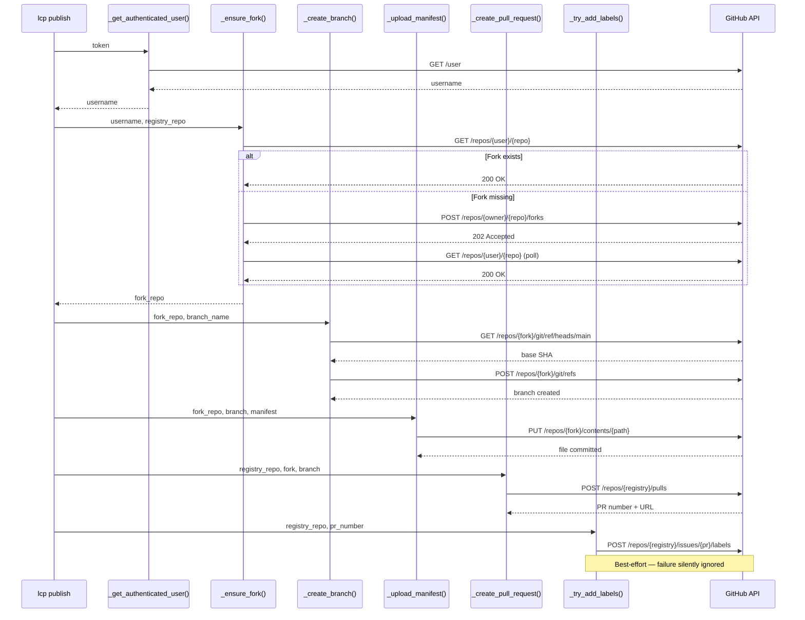

# Registry Publish - Architecture

## Overview

This document covers the internals of the publish module: how the GitHub API workflow is orchestrated, how authentication and fork management work, and how pull requests are structured for the registry.

---

## Publish Workflow

**Function:** `publish_manifest()` in `src/lcp/publish.py`

The publish pipeline executes six sequential steps, each handled by a dedicated internal function. If any step fails, a `PublishError` is raised with a descriptive message and the pipeline stops.



---

## GitHub API Communication

**Function:** `_github_request()` in `src/lcp/publish.py`

All GitHub API calls flow through a single helper that wraps `urllib.request`. This is consistent with the approach used by `_fetch_from_registry()` in `src/lcp/mcp_server.py` — no external HTTP library is required.

Each request includes three headers: the `Accept` header for the GitHub JSON media type, a `Bearer` authorization header with the user's token, and the `X-GitHub-Api-Version` header pinned to `2022-11-28`. POST and PUT requests additionally set the `Content-Type` to `application/json`.

### Error Handling Strategy

HTTP errors are translated into `PublishError` exceptions with specific messages:

| HTTP Status | Raised Message |
|-------------|---------------|
| 401 | Invalid or expired token — prompt for `repo` or `public_repo` scope |
| 403 | Token lacks required permissions — prompt for `repo` or `public_repo` scope |
| Other | Generic message including the HTTP status code and the response body's `message` field |

Network-level failures (`URLError`) and timeouts (`TimeoutError`) are also wrapped in `PublishError`. The response body is parsed for a `message` field when available to provide actionable error context.

---

## Fork Management

**Function:** `_ensure_fork()` in `src/lcp/publish.py`

Before uploading a manifest, the module ensures the authenticated user has a fork of the registry repository. The function first checks whether the fork already exists via a GET request. If not, it creates one via the GitHub forks API and polls with a configurable interval and maximum attempt count until the fork becomes available. This handles GitHub's asynchronous fork creation, which may take several seconds.

---

## Branch and File Upload

**Functions:** `_create_branch()` and `_upload_manifest()` in `src/lcp/publish.py`

Branch creation reads the SHA of the fork's `main` branch head, then creates a new ref at `refs/heads/lcp/add/{name}/{version}`. The branch naming convention prevents collisions between different packages and versions.

File upload uses the GitHub Contents API to commit the manifest directly to the branch. The manifest JSON is first gzip-compressed and then Base64-encoded before submission, as required by the API. The commit message follows the format `Add {name} v{version} LCP manifest`.

---

## Pull Request Structure

**Function:** `_create_pull_request()` and `_build_pr_body()` in `src/lcp/publish.py`

Each PR created by the publish command follows a consistent format:

| Element | Value |
|---------|-------|
| **Title** | `[new_manifest] Add {name} v{version} ({language})` |
| **Labels** | `new_manifest`, `{language}` |
| **Branch** | `lcp/add/{name}/{version}` on the user's fork |
| **Target** | `main` branch of the registry repository |

The PR body is built by `_build_pr_body()` and contains a metadata table (package name, version, language, symbol count, schema version), the manifest file path within the registry, requested labels, generation details (SDK version and schema version), and a checklist confirming the manifest was generated, validated, and placed in the correct path.

Label application is best-effort via `_try_add_labels()` — contributors typically lack write access to the upstream registry, so label failures are silently ignored. The PR title includes the `[new_manifest]` prefix and the language, making it filterable even without labels.

---

## Registry Path Convention

Manifests are stored in the registry using a sharded path:

```
manifests/{language}/{first_letter}/{name}/{version}.lcp.json.gz
```

The `{first_letter}` segment is the lowercase first character of the package name (e.g. `r` for `requests`, `n` for `numpy`). This sharding ensures no directory in the registry exceeds a manageable number of entries, preventing directory-width problems as the registry grows.

All manifests are stored as gzip-compressed JSON (`.lcp.json.gz`). The sharded path and `.gz` extension match the convention used by `_fetch_from_registry()` in `src/lcp/mcp_server.py`, ensuring that published manifests are immediately consumable by the MCP server's registry fallback.

For example, `requests` version `2.31.0` is stored at:

```
manifests/python/r/requests/2.31.0.lcp.json.gz
```

Package names are validated before path construction — names containing `..`, `/`, or `\` are rejected with a `PublishError` to prevent path traversal.

---

## Related Documentation

- [Registry Publish Overview](index.md) - CLI usage, Python API, and feature integration

---
**Last Updated:** March 2026
**Status:** Implemented
