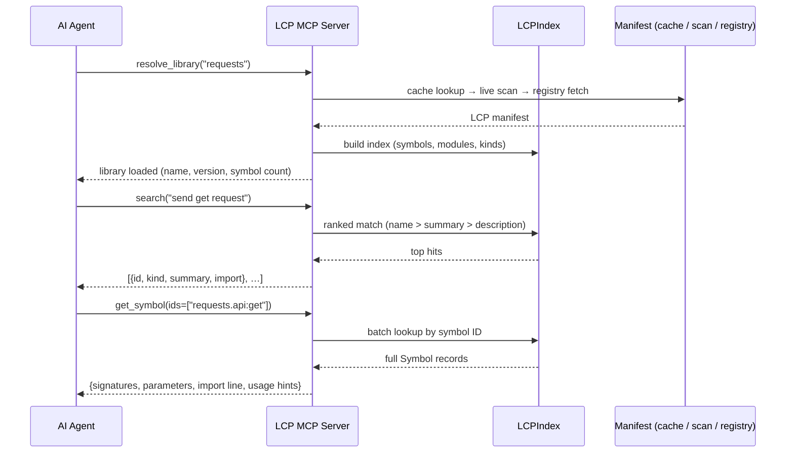

# MCP Server

The `lcp` package ships an [MCP](https://modelcontextprotocol.io/) server that exposes LCP manifests as tools an AI agent can call. This guide shows how to start the server, connect a client, and what the tool surface looks like.

## What is MCP?

Model Context Protocol (MCP) is an open standard for connecting AI assistants to external data sources and tools. It defines a uniform wire format so that any MCP-compatible client — Claude Code, Cursor, GitHub Copilot CLI, and others — can consume data from any MCP server without client-specific integration work. LCP provides the structured library data; MCP provides the communication channel. Together they allow an agent to query accurate, version-specific API information on demand rather than relying on training-time knowledge.

## How it works

When `lcp serve-all` starts, it waits for the agent to load libraries. Each `resolve_library` call builds an in-memory `LCPIndex` from the library's LCP manifest (local cache → live scan of the installed package → optional registry fetch). The index organises every symbol by module path, kind, and class membership so that tool calls are answered without scanning the whole document each time.

By default the live scan runs in a **disposable child interpreter** rather than inside the server process. Importing a package executes its import-time code, so isolating the scan means a package that crashes on import (or calls `sys.exit`) produces a clean, structured error instead of killing the server, and a slow, heavy import cannot stall concurrent tool calls. The child writes the standard LCP JSON document to stdout — the subprocess protocol is the public document format, nothing private. It also unlocks cross-environment scanning: the server can document packages installed in a *different* virtualenv (see [Scanning environment](#scanning-environment)).

The server communicates over **stdio** using the MCP protocol. The client process spawns `lcp serve-all` as a subprocess and exchanges JSON-RPC messages with it. The server registers exactly **four tools**, designed around a three-call workflow: `resolve_library` → `search` → `get_symbol`. The server's MCP *instructions* field teaches connected agents this workflow automatically.



## Starting the server

```bash
lcp serve-all
```

By default the server caches resolved manifests under `~/.lcp/cache/`. Pass `--cache-dir` to redirect the cache, or `--registry` to add a remote registry that is tried when a package is not installed locally:

```bash
lcp serve-all --cache-dir /tmp/lcp-cache \
    --registry https://raw.githubusercontent.com/zazza123/lcp-registry/refs/heads/main
```

Use `--expose` to restrict which packages the agent may load, `--preload` to warm specific libraries at startup, and `--max-response-bytes` to tune the response-size guard. See [CLI reference](../cli.md) for all flags.

### Scanning environment

Live scans run in a child interpreter, and three flags control how:

```bash
lcp serve-all --scan-python /path/to/project/.venv/bin/python --scan-timeout 120
```

- `--scan-python` selects the interpreter **whose environment gets scanned** (default: the interpreter running the server). This is how a globally installed `lcp` documents packages that live only in your project's virtualenv — the target environment does not need `lcp` installed; the server makes its own copy importable in the child without shadowing the target's packages.
- `--scan-timeout` (default 60 s) kills scans that hang, e.g. a package whose import blocks on the network.
- `--scan-mode inprocess` restores the old behavior of importing packages directly into the server process. Use it only where spawning subprocesses is restricted; the server also falls back to it automatically when a scan subprocess cannot be spawned at all and the scan targets the server's own environment.

When using the [Claude Code plugin](claude-code-plugin.md), set `scan_python` (or `python`) in `.lcp-config.json` instead of passing flags — the plugin forwards them.

!!! warning "Trust model"
    Scanning imports the package, and importing executes the package's
    import-time code. The subprocess contains crashes, hangs, and interpreter
    exits — it is **not a sandbox**: the scanned code runs with your user's
    permissions. Only resolve packages you would be willing to import yourself.

!!! warning "`lcp serve` is deprecated"
    The single-manifest `lcp serve <manifest>` command is deprecated. It now starts the same universal server, pre-loaded with the manifest and restricted to that library, and prints a deprecation warning. Use `lcp serve-all --expose <package>` instead.

### Client configuration

=== "Claude Code"

    ```bash
    # Add the universal server (resolves any library on demand)
    claude mcp add lcp-universal -- lcp serve-all

    # With registry fallback
    claude mcp add lcp-universal -- lcp serve-all \
        --registry https://raw.githubusercontent.com/zazza123/lcp-registry/refs/heads/main
    ```

    Or edit `.mcp.json` manually:

    ```json
    {
      "mcpServers": {
        "lcp-universal": {
          "command": "lcp",
          "args": ["serve-all"]
        }
      }
    }
    ```

=== "Cursor / generic MCP client"

    ```json
    {
      "mcpServers": {
        "lcp-universal": {
          "command": "lcp",
          "args": ["serve-all"]
        }
      }
    }
    ```

## Tools exposed by the server

| Tool | Description |
|---|---|
| `resolve_library(name, version?)` | Load a library by pip package name: local cache → live scan → registry fetch. Returns name, version, symbol count, and resolution source. Call this first. When the cache or registry serves a version that differs from the locally installed one (or the package is not installed at all), the response carries an honesty flag — see below. |
| `search(query, library?, module?, kind?, limit?)` | Ranked symbol search — the primary discovery tool. Every hit carries the exact `import` line. Hits present the preferred importable id: a symbol re-exported at the package root appears as `requests:get` with `resolved_via_alias` naming its definition site (`requests.api:get`). An empty query browses: combine with `module=` and/or `kind=` to list contents in deterministic `(kind, name)` order. Default `limit` 20, max 100. |
| `get_symbol(ids, library?)` | Batch detail lookup: full signatures, required/optional parameters (with per-parameter docstring descriptions), return types and what the return value means (`returns_description`), the exceptions a call can raise (`raises`), usage examples extracted from the docstring (`semantics.examples`), and the correct import line per symbol. Both canonical ids and alias ids resolve (including `#member` forms like `requests:Session#get`); the entry echoes the id you asked for, and `resolved_via_alias` names the definition site when it differs. Classes inline all members as one-line summaries. `usage_hints.returns_classes` resolves a return type to its class id. |
| `get_overview(library?)` | Library identity (name, version, resolution source) plus the module tree with per-module symbol counts. |

### Version-mismatch honesty

A live scan always describes the installed package, but a cache or registry hit can describe a different version — for example when the package is not installed locally and the registry's `latest` entry is served. In that case the `resolve_library` response says so explicitly:

```json
{
  "status": "loaded",
  "name": "polars",
  "version": "1.42.1",
  "source": "registry",
  "version_mismatch": true,
  "installed_version": null,
  "resolved_version": "1.42.1"
}
```

`installed_version` is `null` when the package is not installed in the scanned environment. Requesting an explicit `version=` that cannot be honoured additionally produces a `warning` block with code `version_mismatch`, as before.

### The 3-call workflow

1. `resolve_library("polars")` — load the library.
2. `search("read csv", library="polars")` — find candidate symbols, ranked, each with its import line.
3. `get_symbol(ids=["polars:read_csv"])` — verify the exact signature before writing code.

`get_overview` helps when you need orientation before searching; browsing a specific module is `search("", module="polars.io")`.

### Errors and response caps

Every tool returns a structured error dict on failure, with a stable shape:

```json
{
  "error": {
    "code": "ambiguous_library",
    "message": "Multiple libraries are loaded; pass library=<name>.",
    "hint": "Pick one of loaded_libraries and retry with library=<name>.",
    "loaded_libraries": ["requests", "httpx"]
  }
}
```

Rules worth knowing:

- With **one** library loaded, the `library` parameter may be omitted; with **two or more**, it is required — otherwise the server returns `ambiguous_library` listing the loaded names.
- Symbol ids that don't resolve are reported per-id in `not_found`, never as a protocol error.
- Every list-returning response is size-capped (default 25 000 bytes, configurable with `--max-response-bytes`). Capped responses set `"truncated": true` and include a hint describing how to fetch the rest (e.g. narrower `search`, follow-up `get_symbol` with the `not_returned` ids). Within a single symbol entry, docstring examples are dropped first (`"examples_truncated": true`) before the description is shortened, so signature data always survives.

## Programmatic usage

You can create and start the server from Python directly:

```python
from lcp.mcp_server import create_universal_server

server = create_universal_server(
    name="lcp-universal",
    cache_dir="~/.lcp/cache",     # optional
    registry_url="https://raw.githubusercontent.com/zazza123/lcp-registry/refs/heads/main",  # optional
    expose=["requests"],          # optional allow-list
    preload=["requests"],         # optional warm-up
)
server.run()                       # serve on stdio (blocks)
```

`create_universal_server` returns an `LCPServer` dataclass bundling the underlying FastMCP instance (`server.mcp`), the library index registry (`server.index`), and the raw tool callables (`server.tools`) for in-process use without the MCP protocol:

```python
server = create_universal_server(no_cache=True)
print(server.tools["resolve_library"]("requests")["symbol_count"])
print(server.tools["search"]("send get request")["results"][0])
```

The deprecated `create_server(manifest_path)` / `run_server(manifest_path)` wrappers build the same server pre-loaded with one manifest and emit a `DeprecationWarning`.

## See also

- [Claude Code plugin](claude-code-plugin.md) — packaged version of `lcp serve-all` for Claude Code.
- [CLI reference](../cli.md) — all flags for `serve-all`.
