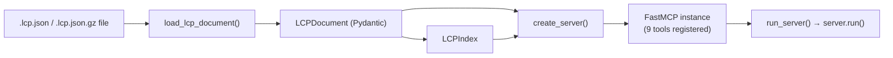
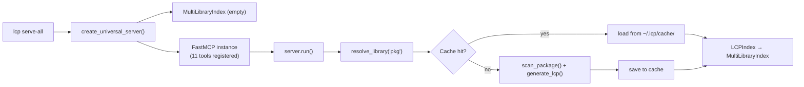
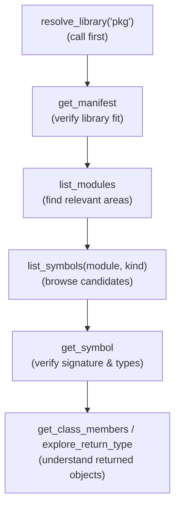
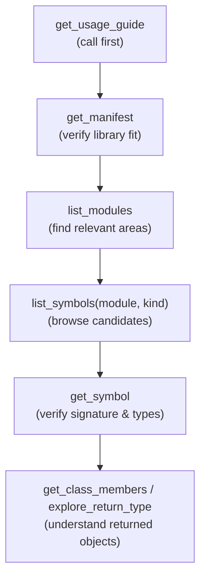

# MCP Server - Architecture

## Overview

The MCP Server exposes Python library documentation as a set of MCP tools that AI agents can call to explore any library's public API. It is built on [FastMCP](https://github.com/jlowin/fastmcp) and supports two modes:

- **Single-library mode** (`create_server` / `lcp serve`): loads one pre-built `.lcp.json` manifest.
- **Universal mode** (`create_universal_server` / `lcp serve-all`): resolves any pip-installed package on demand, with optional local caching.

## Single-Library Server Lifecycle

## Universal Server Lifecycle

## Index Design

`LCPIndex` is built once per library from its `LCPDocument` and kept in memory for the lifetime of the server. It maintains four lookup structures derived from a single pass over the symbol map:

| Index | Key | Value |
|-------|-----|-------|
| `symbols_by_id` | `symbol_id` (str) | `Symbol` object |
| `symbols_by_module` | module path (str) | list of `symbol_id` strings |
| `symbols_by_kind` | kind value (str) | list of `symbol_id` strings |
| `class_members` | class `symbol_id` | list of member `symbol_id` strings |

Class membership is determined by the presence of `#` in the symbol ID (e.g. `pathlib:Path#resolve` belongs to `pathlib:Path`). The `modules` set is built in the same pass and is the source for `list_modules`.

`MultiLibraryIndex` wraps a `dict[str, LCPIndex]` and tracks the last-resolved library as the implicit default when no `library=` parameter is provided.

## Cache Design

Manifests are cached as gzip-compressed `.lcp.json.gz` files under `~/.lcp/cache/{name}/{version}.lcp.json.gz`. `load_lcp_document()` detects the `.gz` extension and decompresses transparently, so callers need not distinguish between formats.

| Situation | Cache behaviour |
|-----------|----------------|
| Package has `importlib.metadata` version | Exact version match required |
| Package has no metadata version | Any cached entry for that name is returned |
| `--no-cache` flag | Cache reads and writes are both skipped |
| Cache write failure | Silently ignored (non-fatal) |
| Legacy `.lcp.json` entry found | Loaded transparently as a fallback when no `.lcp.json.gz` exists |

## Tool Inventory

### Universal Server Tools (11)

In addition to the 9 standard tools below (all with an optional `library=` parameter), the universal server exposes two new tools:

| Tool | Purpose |
|------|---------|
| `resolve_library(name)` | Load a library from cache or live scan; sets it as the implicit default |
| `list_libraries()` | List all currently loaded libraries with their metadata |

### Standard Tools (9)

These tools are registered on both the single-library and universal servers. In the universal server, all tools accept an optional `library` parameter to target a specific loaded library.

#### Orientation

| Tool | Purpose |
|------|---------|
| `get_usage_guide` | Returns the recommended exploration workflow, cost-optimization tips, and common agent mistakes. |
| `get_manifest` | Returns library name, version, language, and schema version. |

#### Browsing

| Tool | Purpose |
|------|---------|
| `list_modules` | Returns a sorted list of all unique module paths in the index. |
| `list_symbols` | Returns lightweight symbol summaries (id, kind, summary), optionally filtered by `module` and/or `kind`. |

#### Deep Inspection

| Tool | Purpose |
|------|---------|
| `get_symbol` | Returns full `Symbol` data for one ID, plus a `usage_hints` block with required parameters, optional parameters, async flag, and return type. |
| `get_class_members` | Returns lightweight summaries of all members of a given class. |
| `explore_return_type` | Resolves the return type of a function or method and finds matching class IDs. |

#### Discovery

| Tool | Purpose |
|------|---------|
| `search_symbols` | Full-text search over all symbols by name, summary, and/or description. Marked as expensive. |
| `get_suggestions` | Maps a natural-language task description to relevant modules and symbols. |

## Recommended Exploration Workflow

### Universal server

### Single-library server

## Symbol ID Format

Symbol IDs follow the format `module_path:entity_path`, where class members use a `#` separator:

| Example ID | Refers to |
|------------|-----------|
| `json:loads` | Top-level function `loads` in the `json` module |
| `pathlib:Path` | Class `Path` in the `pathlib` module |
| `pathlib:Path#resolve` | Method `resolve` on `pathlib.Path` |

This format is used as keys in all index structures and as the primary identifier passed to tools like `get_symbol`, `get_class_members`, and `explore_return_type`.

## CLI Integration

| Command | Delegates to |
|---------|-------------|
| `lcp serve <manifest>` | `run_server(manifest_path, name=...)` |
| `lcp serve-all` | `run_universal_server(name=..., cache_dir=..., no_cache=...)` |

## Related Documentation

- [MCP Server Overview](index.md)
- [AI DocGen](../ai_docgen/index.md) - Generates the docstrings that populate the `semantics.summary` and `semantics.description` fields used by search and suggestion tools

---
**Last Updated:** March 2026
**Status:** Implemented
