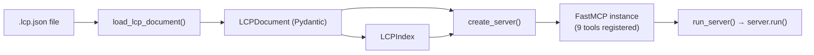
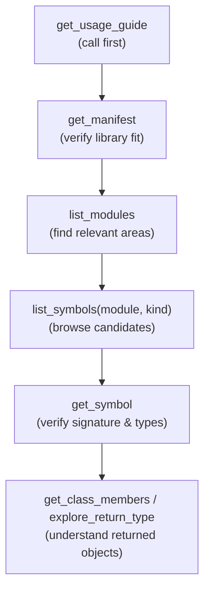

# MCP Server - Architecture

## Overview

The MCP Server exposes a pre-built LCP manifest as a set of MCP tools that AI agents can call to explore a Python library's public API. It is built on [FastMCP](https://github.com/jlowin/fastmcp) and is designed to guide agents toward efficient, cost-aware exploration patterns.

## Server Lifecycle

`load_lcp_document()` reads and validates the manifest file into an `LCPDocument`. `LCPIndex` is then built from that document and both are captured in the closure of each registered tool. `create_server()` returns the configured `FastMCP` instance; `run_server()` is the top-level entry point that calls `create_server()` and then starts the server.

## Index Design

`LCPIndex` is built once at startup from the `LCPDocument` and kept in memory for the lifetime of the server. It maintains four lookup structures derived from a single pass over the symbol map:

| Index | Key | Value |
|-------|-----|-------|
| `symbols_by_id` | `symbol_id` (str) | `Symbol` object |
| `symbols_by_module` | module path (str) | list of `symbol_id` strings |
| `symbols_by_kind` | kind value (str) | list of `symbol_id` strings |
| `class_members` | class `symbol_id` | list of member `symbol_id` strings |

Class membership is determined by the presence of `#` in the symbol ID (e.g. `pathlib:Path#resolve` belongs to `pathlib:Path`). The `modules` set is built in the same pass and is the source for `list_modules`.

## Tool Inventory

The server registers nine tools. They are grouped here by their role in the recommended exploration workflow.

### Orientation

| Tool | Purpose |
|------|---------|
| `get_usage_guide` | Returns the recommended exploration workflow, cost-optimization tips, and a list of common agent mistakes. Intended to be called first. |
| `get_manifest` | Returns library name, version, language, schema version, and compatibility metadata from the manifest header. |

### Browsing

| Tool | Purpose |
|------|---------|
| `list_modules` | Returns a sorted list of all unique module paths in the index. |
| `list_symbols` | Returns lightweight symbol summaries (id, kind, summary), optionally filtered by `module` and/or `kind`. Filtering happens by intersecting the `symbols_by_module` and `symbols_by_kind` index sets. |

### Deep Inspection

| Tool | Purpose |
|------|---------|
| `get_symbol` | Returns full `Symbol` data for one ID, plus a `usage_hints` block: required parameters, optional parameters with defaults, async flag, and return type. Also emits a suggestion to call `explore_return_type` when the return type looks like a user-defined class. |
| `get_class_members` | Returns lightweight summaries of all members of a given class, using the `class_members` index. Returns an error if the ID is not a class. |
| `explore_return_type` | Resolves the return type of a function or method and finds matching class IDs in the index. Returns `matching_classes` with their summaries and a `suggestions` block pointing to `get_class_members` or `search_symbols`. |

### Discovery

| Tool | Purpose |
|------|---------|
| `search_symbols` | Full-text search over all symbols by name, summary, and/or description. Marked as expensive in its docstring; browsing tools are preferred when possible. Accepts a `fields` parameter to restrict which fields are searched. |
| `get_suggestions` | Accepts a natural-language task description, tokenizes it, and finds modules and symbols whose names or summaries contain matching words. Returns up to 5 modules and 10 symbols (classes and functions only) along with concrete `next_steps` strings. |

## Recommended Exploration Workflow

The `get_usage_guide` tool encodes a six-step workflow for agents:

`search_symbols` is deliberately positioned as a fallback rather than an entry point, because it scans the full index and can return large result sets.

## Symbol ID Format

Symbol IDs follow the format `module_path:entity_path`, where class members use a `#` separator:

| Example ID | Refers to |
|------------|-----------|
| `json:loads` | Top-level function `loads` in the `json` module |
| `pathlib:Path` | Class `Path` in the `pathlib` module |
| `pathlib:Path#resolve` | Method `resolve` on `pathlib.Path` |

This format is used as keys in all index structures and as the primary identifier passed to tools like `get_symbol`, `get_class_members`, and `explore_return_type`.

## CLI Integration

The `lcp serve` command in `src/lcp/cli.py` accepts a path to a `.lcp.json` file and an optional `--name` flag to override the default server name (`lcp-{library-name}`). It delegates directly to `run_server()`.

## Related Documentation

- [MCP Server Overview](index.md)
- [AI DocGen](../ai_docgen/index.md) - Generates the docstrings that populate the `semantics.summary` and `semantics.description` fields used by search and suggestion tools

---
**Last Updated:** February 2026
**Status:** Implemented
