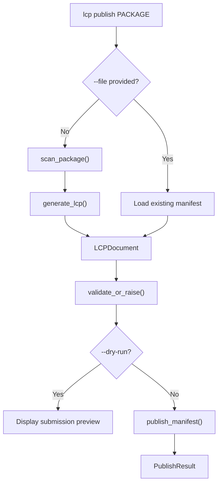

# Registry Publish

## Overview

The Registry Publish module submits LCP manifests to a remote registry by opening a GitHub Pull Request. It automates the full contribution workflow — scanning the package, validating the manifest, forking the registry repository, uploading the file to the correct path, and creating a PR with structured metadata and labels.

## Key Features

- Scans an installed Python package and generates a validated LCP manifest in a single command
- Forks the registry repository automatically (or reuses an existing fork)
- Uploads the manifest **gzip-compressed** to the canonical sharded registry path (`manifests/{language}/{first_letter}/{name}/{version}.lcp.json.gz`)
- Creates a pull request with structured metadata table, checklist, and generation details
- Applies `new_manifest` and `{language}` labels to the PR (best-effort)
- Supports `--dry-run` to preview the submission without creating a PR
- Accepts an existing manifest file via `--file` instead of scanning
- Token can be provided via `--token`, `LCP_GITHUB_TOKEN`, or `GITHUB_TOKEN` environment variable

## Documents

- [Architecture](architecture.md) - GitHub API workflow, authentication, error handling, and PR structure internals
- [Migration Guide](migration.md) - How to migrate existing plain `.lcp.json` manifests to the new `.lcp.json.gz` format

## Key Components

| Component | Location | Purpose |
|-----------|----------|---------|
| `publish_manifest()` | `src/lcp/publish.py` | Orchestrates the full publish workflow: authenticate → fork → branch → upload → PR |
| `PublishResult` | `src/lcp/publish.py` | Dataclass holding the PR URL, number, manifest path, and package metadata |
| `PublishError` | `src/lcp/publish.py` | Exception raised when any step of the publish workflow fails |
| CLI `publish` command | `src/lcp/cli.py` | Click command exposing the publish workflow to the CLI |

## Data Flow

## Prerequisites

Publishing to the registry requires:

- A **GitHub account** with a personal access token that has `repo` or `public_repo` scope
- The target package **installed** in the current Python environment (unless `--file` is used)
- Network access to the GitHub API (`api.github.com`)

## CLI Usage

The `lcp publish` command accepts a package name and submits its manifest to the registry. Status messages go to stderr; the command exits with code 0 on success and 1 on failure.

| Flag | Default | Purpose |
|------|---------|---------|
| `<PACKAGE>` | *(required)* | Name of the installed Python package to publish |
| `--token` | `LCP_GITHUB_TOKEN` or `GITHUB_TOKEN` env var | GitHub personal access token |
| `--registry-repo` | `zazza123/lcp-registry` | Target registry repository in `owner/name` format |
| `--file` | *(none)* | Path to an existing `.lcp.json` file (skips scanning) |
| `--include-private` | off | Include private symbols when scanning |
| `--no-recursive` | off | Do not scan submodules recursively |
| `--dry-run` | off | Preview submission without creating a PR |

When `--dry-run` is set, the command scans and validates the manifest, prints the PR title, labels, and target registry, then exits without making any API calls. When `--file` is provided, the command loads and validates the given manifest file instead of scanning the package.

## Python API

`publish_manifest()` in `src/lcp/publish.py` is the primary entry point. It accepts a validated `LCPDocument`, a GitHub token string, and an optional `registry_repo` string in `owner/name` format (defaulting to `zazza123/lcp-registry`). It returns a `PublishResult` dataclass containing the PR URL, PR number, manifest path, package name, version, and language.

All GitHub API errors are wrapped in `PublishError` with descriptive messages covering authentication failures, permission errors, network issues, and timeouts. Path traversal attempts in package names (containing `..`, `/`, or `\`) are rejected before any API calls are made.

## Integration with Other Features

| Feature | How it connects |
|---------|----------------|
| [Manifest Generation](../manifest/index.md) | The publish command uses `scan_package()` and `generate_lcp()` to produce the manifest |
| [MCP Server](../mcp_server/index.md) | Published manifests become available via the registry fallback in `resolve_library_document()` |
| [Version Diff](../diff/index.md) | Users can diff previous and new versions before publishing updates |

## Related Documentation

- [Architecture](architecture.md) - GitHub API workflow, fork management, and PR structure details

---
**Last Updated:** March 2026
**Status:** Implemented
