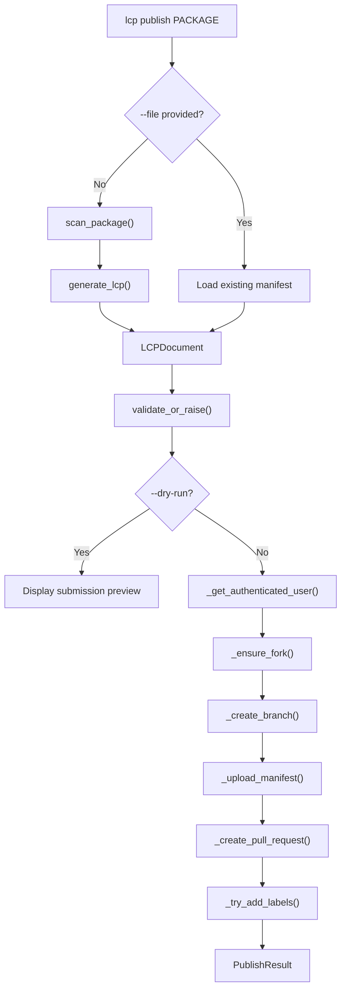

# Registry Publish

## Overview

The Registry Publish module submits LCP manifests to a remote registry by opening a GitHub Pull Request. It automates the full contribution workflow — scanning the package, validating the manifest, forking the registry repository, uploading the file to the correct path, and creating a PR with structured metadata and labels.

## Key Features

- Scans an installed Python package and generates a validated LCP manifest in a single command
- Forks the registry repository automatically (or reuses an existing fork)
- Uploads the manifest to the canonical registry path (`manifests/{language}/{name}/{version}.lcp.json`)
- Creates a pull request with structured metadata table, checklist, and generation details
- Applies `new_manifest` and `{language}` labels to the PR (best-effort)
- Supports `--dry-run` to preview the submission without creating a PR
- Accepts an existing manifest file via `--file` instead of scanning
- Token can be provided via `--token`, `LCP_GITHUB_TOKEN`, or `GITHUB_TOKEN` environment variable

## Key Components

| Component | Location | Purpose |
|-----------|----------|---------|
| `publish_manifest()` | `src/lcp/publish.py` | Orchestrates the full publish workflow: authenticate → fork → branch → upload → PR |
| `PublishResult` | `src/lcp/publish.py` | Dataclass holding the PR URL, number, manifest path, and package metadata |
| `PublishError` | `src/lcp/publish.py` | Exception raised when any step of the publish workflow fails |
| CLI `publish` command | `src/lcp/cli.py` | Click command exposing the publish workflow to the CLI |

## Data Flow

## Prerequisites

Publishing to the registry requires:

- A **GitHub account** with a personal access token that has `repo` or `public_repo` scope
- The target package **installed** in the current Python environment (unless `--file` is used)
- Network access to the GitHub API (`api.github.com`)

## CLI Usage

The `lcp publish` command accepts a package name and submits its manifest to the registry. Status messages go to stderr; the command exits with code 0 on success and 1 on failure.

| Flag | Default | Purpose |
|------|---------|---------|
| `PACKAGE` | *(required)* | Name of the installed Python package to publish |
| `--token` | `LCP_GITHUB_TOKEN` or `GITHUB_TOKEN` env var | GitHub personal access token |
| `--registry-repo` | `zazza123/lcp-registry` | Target registry repository in `owner/name` format |
| `--file` | *(none)* | Path to an existing `.lcp.json` file (skips scanning) |
| `--include-private` | off | Include private symbols when scanning |
| `--no-recursive` | off | Do not scan submodules recursively |
| `--dry-run` | off | Preview submission without creating a PR |

## Pull Request Structure

Each PR created by the publish command follows a consistent format:

| Element | Value |
|---------|-------|
| **Title** | `[new_manifest] Add {name} v{version} ({language})` |
| **Labels** | `new_manifest`, `{language}` |
| **Branch** | `lcp/add/{name}/{version}` on the user's fork |
| **Target** | `main` branch of the registry repository |

The PR body contains a metadata table (package name, version, language, symbol count, schema version), the manifest path, requested labels, generation details, and a checklist confirming the manifest was generated, validated, and correctly placed.

## Registry Path Convention

Manifests are stored in the registry using the path:

`manifests/{language}/{name}/{version}.lcp.json`

For example, a Python `requests` package at version `2.31.0` is placed at `manifests/python/requests/2.31.0.lcp.json`. This matches the path convention used by `_fetch_from_registry()` in `src/lcp/mcp_server.py` for reading manifests from the registry.

## Python API

`publish_manifest()` in `src/lcp/publish.py` is the primary entry point. It accepts a validated `LCPDocument`, a GitHub token, and an optional registry repository string. It returns a `PublishResult` dataclass containing the PR URL, PR number, manifest path, package name, version, and language.

The function performs six steps internally: authenticating via `_get_authenticated_user()`, forking the registry via `_ensure_fork()`, creating a branch via `_create_branch()`, uploading the manifest via `_upload_manifest()`, opening a PR via `_create_pull_request()`, and attempting to add labels via `_try_add_labels()`. All GitHub API communication uses `_github_request()`, which wraps `urllib.request` with authentication headers and structured error handling.

## Error Handling

All GitHub API errors are wrapped in `PublishError` with descriptive messages:

| HTTP Status | Meaning |
|-------------|---------|
| 401 | Invalid or expired token |
| 403 | Token lacks required permissions |
| 404 | Resource not found (e.g. registry repo) |
| 422 | Validation error (e.g. branch or PR already exists) |
| Network/Timeout | Connectivity issues with GitHub API |

Path traversal attempts in package names (containing `..`, `/`, or `\`) are rejected before any API calls are made.

## Integration with Other Features

| Feature | How it connects |
|---------|----------------|
| [Manifest Generation](../manifest/index.md) | The publish command uses `scan_package()` and `generate_lcp()` to produce the manifest |
| [MCP Server](../mcp_server/index.md) | Published manifests become available via the registry fallback in `resolve_library_document()` |
| [Version Diff](../diff/index.md) | Users can diff previous and new versions before publishing updates |

---
**Last Updated:** March 2026
**Status:** Implemented
